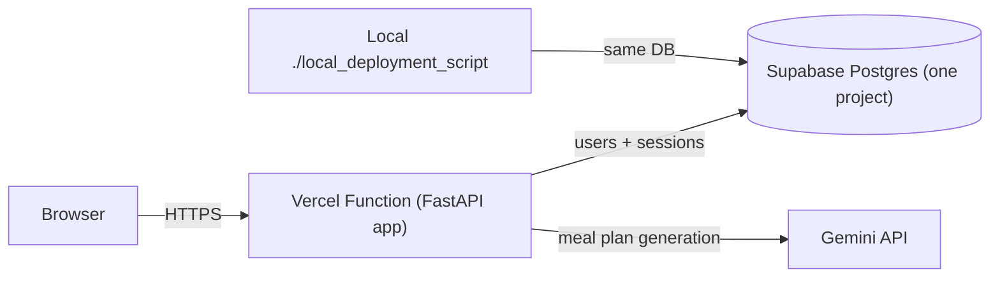

# Deploy Nutri Assistant to Vercel + Supabase

## The problem in plain language

The app currently assumes it runs forever on one machine: user accounts live in a SQLite file (`users.db`) on disk, and chat sessions live in a Python dict in memory. Vercel runs the app "serverless" — instances start and stop on demand, and their disk and memory are throwaway. So both stores must move to a database that lives outside the app: Supabase (hosted Postgres).



## What changes and what doesn't

- Changes: `agent/users.py` (SQLite → Supabase), `agent/session.py` (memory → Supabase), the routes that mutate sessions (`src/app/routes/chat.py`, `plan.py`, `profile.py`, `auth.py`) now save after mutating, `pyproject.toml` (new dependency + Vercel entrypoint), `vercel.json` (new — function timeout), `tests/conftest.py` + the test files that construct stores directly (they need fakes — see step 5), `view_user.py` (reads `users.db` directly; update or retire it).
- Doesn't change: `agent/llm.py`, `agent/prompts.py`, schemas, the HTML UI, evals/`traces.db` (stays local-only, it's a dev tool).
- Why routes change: today `/chat` mutates `session.history` in place and it "just persists" because it's the same object in memory. With a database, every mutation must be explicitly written back — this is the core mental shift of the migration.

## Steps

### 1. Supabase project and schema

Use **one** Supabase project for both local development and Vercel. Prefer reusing the existing `nutri-assistant` project if its tables are free; otherwise create a single new project (e.g. `nutri-assistant`).

Local `.env` and Vercel env vars point at the **same** `SUPABASE_URL` and `SUPABASE_SERVICE_ROLE_KEY`. That means a plan you generate on your laptop lands in the same database the live site reads — fine for five demo accounts on a learning MVP; not fine if this ever holds real users' data (then split into two projects).

Two tables:

- `users`: `username` (pk), `password`, `profile_json`, `active_plan_json` — mirrors the current SQLite schema in [agent/users.py](agent/users.py).
- `sessions`: `session_id` (pk), `profile_json`, `current_plan_json`, `history_json`, `updated_at` — what the in-memory `Session` dataclass holds today.

JSON columns keep the Pydantic-serialization pattern the code already uses, so the migration is a storage swap, not a redesign.

Enable Row Level Security on both tables with **no** policies for the anon key: the app talks to Supabase exclusively from the server with the service-role key (which bypasses RLS), so a leaked publishable key can't read anyone's data.

### 2. New dependency: `supabase` Python client

Talks to Supabase over HTTPS instead of holding open database connections — the safe pattern for serverless, where hundreds of short-lived instances would otherwise exhaust Postgres connection limits.

### 3. Rewrite the two stores (same public interface)

- `UserStore` in [agent/users.py](agent/users.py): same methods (`verify_credentials`, `get_user`, `save_profile`, `save_plan`, `save_profile_and_plan`), Supabase-backed. Demo users are seeded with passwords read from a `DEMO_USER_PASSWORDS` env var instead of the hardcoded list, so the public repo no longer exposes working credentials.
- `SessionStore` in [agent/session.py](agent/session.py): `create`/`get` become reads/writes to the `sessions` table, plus a new `save(session_id, session)` that routes call after appending to history. The file's own comment predicted this: "this file is the only one that changes" — plus the one-line `save` calls in routes.

### 4. Vercel configuration

- Add to `pyproject.toml` (Vercel auto-detects FastAPI but our app lives at a non-standard path):

```toml
[tool.vercel]
entrypoint = "src.app.main:app"
```

- Add a `vercel.json` raising the function timeout — plan generation waits on Gemini, which can take 10–30s+, longer than the default limit. The key must be the resolved entrypoint file:

```json
{
  "functions": {
    "src/app/main.py": {
      "maxDuration": 60
    }
  }
}
```

- `uv.lock` and `.python-version` are already committed — Vercel installs with uv natively, so no `requirements.txt` needed.
- Set the same environment variables in Vercel and in local `.env`: `GEMINI_API_KEY`, `SUPABASE_URL`, `SUPABASE_SERVICE_ROLE_KEY`, `DEMO_USER_PASSWORDS`. The service-role key bypasses RLS — it lives only in Vercel env vars and `.env`, never in the browser or the repo.

### 5. Fix the tests (bigger than it looks)

The tests do **not** use fake stores today — that's a common misreading of `dependency_overrides`. What actually happens (see [tests/conftest.py](tests/conftest.py)): the fixtures construct a **real** `UserStore(tmp_path / "users.db")` (genuine SQLite, just at a temp path) and a **real** in-memory `SessionStore()`, then inject those real objects into the app. The injection mechanism is a fake-swap *pattern*, but the objects are the production classes.

Consequence: the moment `UserStore.__init__` stops taking a file path and `SessionStore` stops being an in-memory dict, every fixture that constructs them breaks — that's `conftest.py` plus the local fixtures in `test_auth.py`, `test_profile.py`, `test_session_resume.py`, `test_plan_import.py`, `test_users.py`, and `test_persistence.py`.

The fix: write small `FakeUserStore` and `FakeSessionStore` classes in `tests/conftest.py` — plain dicts implementing the same methods (including the new `save()`), no I/O at all — and construct those in the fixtures instead. Tests stay fast and offline, and CI never needs Supabase credentials. `test_users.py` tests SQLite-specific behavior directly; it gets rewritten against the fake or against a Supabase test double, whichever teaches more.

### 6. Deploy and verify

- Connect the existing GitHub repo (`guilherme-t-l/nutritionist-assistant-jul-26`) to Vercel so every push to `main` deploys.
- Verify: `GET /health` returns ok, log in as a demo user, generate a plan, send a chat message, then send a second chat message (this is the real test — it proves sessions survive across separate serverless invocations), log out and back in to confirm the plan persisted.

## What to watch out for

- Local and Vercel share one database. A local `POST /plan` as `demo1` overwrites that user's plan on the live site (and vice versa). For this MVP that's intentional simplicity; if it ever hurts, the fix is a second Supabase project, not a code rewrite — stores already read URL/key from env.
- Local dev keeps working via `./local_deployment_script` — `.env` supplies Supabase + Gemini keys, so no more `users.db` file locally.
- Cold starts: the first request after idle takes a few extra seconds (Vercel spins up an instance, plus the Gemini call itself). Normal for serverless, not a bug.

## Accepted trade-offs (deliberate, not oversights)

- **One shared Supabase project for local + prod.** Avoids a second project (cost / quota / setup). Accept that demo data is shared; split later if needed by pointing env vars at different projects — no store redesign.
- **Passwords stay plaintext in the database.** Moving them to `DEMO_USER_PASSWORDS` fixes the *repo* leak; Supabase still stores them as cleartext. Acceptable for five demo accounts on a learning MVP; hashing (e.g. bcrypt) is the first change if this ever holds real accounts.
- **Session saves are last-write-wins.** `/chat` does read → mutate → write with no locking, so two simultaneous messages on the same session could drop a turn. Irrelevant for a single-user demo; noting it so it's a known limitation, not a surprise.
