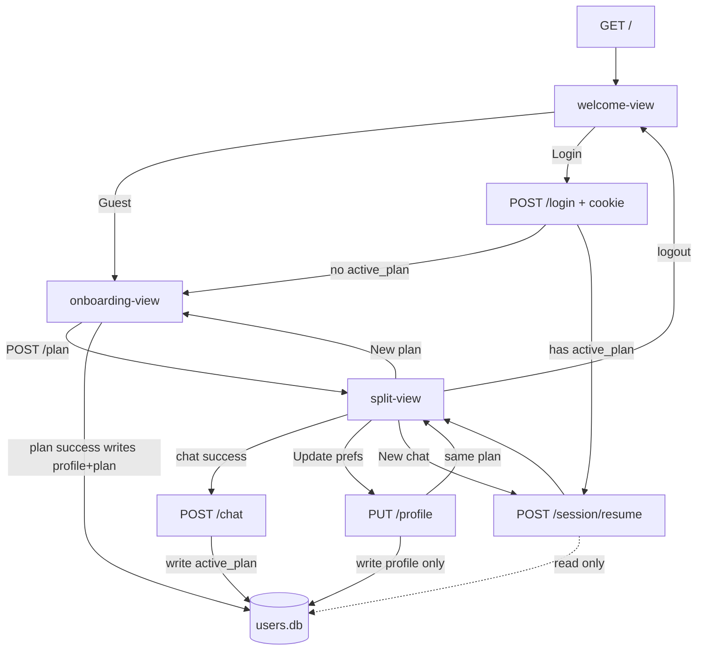

# PRD — Login & Persistent Meal Plan

## Goal
Let returning users identify themselves so the assistant can load their **profile + active meal plan** and keep continuity across sessions, browser reloads, and server restarts — without asking them to re-enter onboarding every time. Users should be able to keep and update their meal plans and user preferences (profile) across sessions.

Guest mode stays available and behaves exactly as the app does today.

## Design

### Welcome screen (new entry)
`GET /` shows a welcome screen **before** onboarding / chat:

```
Welcome to Nutritionist AI

[ Continue as Guest ]

—— or ——

Username  [____________]
Password  [____________]
[ Log In ]
```

| Choice | What happens |
|---|---|
| **Continue as Guest** | Current flow unchanged: onboarding form → `POST /plan` → chat. No account, no durable storage |
| **Log In** | Validate against the predefined user table → establish an auth session → load that user’s stored `profile` + `active_plan` (if any) |

### Guest mode (unchanged)
Same as today:

- No authentication
- Session lives only in `SessionStore` (+ browser `sessionStorage` for UI)
- No meal-plan / profile persistence across restarts
- Every fresh visit starts from welcome → guest → onboarding (empty state)

### Logged-in mode

#### First login (no stored plan yet)
1. Authenticate
2. Show the existing onboarding form
3. `POST /plan` generates the first plan (same as guest)
4. Persist on the user account: `profile` + `active_plan` (**only after** the plan is successfully generated)
5. Enter the chat / plan UI

#### Returning login (has stored plan)
1. Authenticate
2. Skip onboarding
3. New chat + meal plan conversation screen. The user can:
  - Create a **new conversation session** seeded with stored `profile` + `active_plan` (DB **read-only** — does not overwrite the plan)
  - **Update preferences** (`PUT /profile`) without regenerating or overwriting the plan
  - **New plan** via onboarding → `POST /plan` (only then replace `active_plan`)
  - Logout

### DB write rules (non-negotiable)

| Action | Writes `profile`? | Writes `active_plan`? |
|---|---|---|
| Login / logout / `/auth/me` | no | no |
| **New chat** / `POST /session/resume` | no | **no** (read only) |
| **Update preferences** (`PUT /profile`) | yes | **no** |
| `POST /plan` succeeds (plan shown in right panel) | yes | **yes** |
| `POST /chat` succeeds (updated plan shown in right panel) | no | **yes** |
| `/plan` or `/chat` fails | no | no |

**Rule:** `active_plan` is overwritten only after a plan is **actually generated** and returned for display — never because the user started a new chat, resumed, logged in, or edited preferences alone.

### MVP authentication
Ship **five hardcoded users**. No signup, password recovery, or account management.

| Username | Password |
|---|---|
| demo1 | password1 |
| demo2 | password2 |
| demo3 | password3 |
| demo4 | password4 |
| demo5 | password5 |

Credentials live in a small server-side table / config (plain text is fine for this learning MVP). Do **not** invent real crypto / OAuth here.

### Auth session behavior
Once logged in:

- Stay authenticated until **Log out** (or auth cookie/token expiry if we set a simple TTL)
- **New chat** does not require logging in again
- Auth identity is separate from conversation `session_id`:
  - **User** = durable identity + stored `profile` / `active_plan`
  - **Session** = one conversation (`history` + working `current_plan`), as today

Prefer an HTTP-only cookie (or equivalent) for auth so the browser keeps the login across reloads. Conversation `session_id` can stay in the request body / `sessionStorage` as it does now, or be recreated on each “new chat.”

### Durable storage (MVP)
Add a tiny persistence layer for **users only** (guests stay in-memory).

Per user, store at least:

| Field | Purpose |
|---|---|
| `username` | Login id |
| `password` | MVP plaintext match |
| `profile` | Latest `UserProfile` JSON (needed for system prompt) |
| `active_plan` | Latest `MealPlan` JSON or `null` |

Suggested implementation: one SQLite file (e.g. `users.db`). Swap later; keep a clear repository interface:

- `get_user`, `verify_credentials`
- `save_profile` — profile only (prefs update)
- `save_plan` — plan only (`/chat` write-back)
- `save_profile_and_plan` — both (`/plan` write-back)

**Do not** reuse `traces.db` (eval/tracing only).

Chat **history** persistence across logins is **out of scope** for MVP: a returning user gets plan + profile continuity, but each login / “new chat” starts with empty `history` (the plan in the system prompt carries the nutrition continuity).

### LLM context

Same layout as `PRD-llm-context.md`. Auth only changes **where** profile / plan are loaded from.

#### Guest
```
system:   persona + profile [+ current_plan after first /plan]
messages: history + new user turn
```
Source: in-memory `Session` only.

#### Logged-in
```
system:   persona + profile [+ active/current plan when present]
messages: history + new user turn
```
Source:

- `profile` / `active_plan` loaded from durable user storage when the conversation starts
- after successful `/chat`, `active_plan` is written back; after `PUT /profile`, only `profile` is written back
- `history` still session-scoped (cleared on new chat / new login conversation)

| State | System prompt contains |
|---|---|
| Guest, before first plan | Persona + profile |
| Guest, after plan / during chat | Persona + profile + current plan |
| Logged-in, returning with saved plan | Persona + profile + stored plan (even on the first message of a new chat) |
| Logged-in, after prefs update (no new plan) | Persona + **new** profile + **same** stored plan |
| Logged-in, first time / after “new plan” cleared | Persona + profile only, until `/plan` succeeds |

## Out of scope
- Signup, password reset, email, OAuth, roles / admin UI
- Uploading or pasting an external meal plan
- Persisting full chat history across logins
- Multi-device sync guarantees beyond “same DB file / same server”
- Replacing Gemini or changing the `MealPlan` schema
- Production-hardening (hashed passwords, HTTPS-only, rate limits) beyond a minimal cookie session

---

## Mock walkthrough (validated contract)

Treat every request/response below as the implementation contract.

### 1. Two identities

| | **User** (account) | **Session** (conversation) |
|---|---|---|
| What it is | `demo1` … `demo5` | One chat thread |
| Stores | `profile` + `active_plan` | `profile` copy + `current_plan` + `history` |
| Where | `users.db` (SQLite) | In-memory `SessionStore` + browser `sessionStorage` |
| Survives server restart? | Yes | No |
| Survives logout / new chat? | Yes (see write rules above) | No — new `session_id`, empty `history` |

Guests have **no User**. They only get a Session (same as today).

```
┌─────────────────────────────────────────────────────────┐
│ Browser                                                  │
│  cookie: nutri_user=demo1     (auth — survives reload)   │
│  sessionStorage: session_id, plan JSON  (UI convenience) │
└───────────────────────────┬─────────────────────────────┘
                            │
┌───────────────────────────▼─────────────────────────────┐
│ Server                                                   │
│  users.db row for demo1:  profile + active_plan          │
│  SessionStore[abc123]:    profile, current_plan, history │
└─────────────────────────────────────────────────────────┘
```

### 2. Screens (one HTML page, three views)

Same file as today (`onboarding.html`). Only one view visible at a time.

```
┌──────────────────┐     ┌──────────────────┐     ┌──────────────────┐
│  WELCOME         │     │  ONBOARDING      │     │  SPLIT (chat)    │
│                  │     │                  │     │                  │
│  Nutritionist AI │     │  (existing form) │     │  chat │ plan     │
│                  │     │                  │     │                  │
│  [Guest]         │────▶│  [Generate plan] │────▶│  [New chat]      │
│                  │     │                  │     │  [Update prefs]* │
│  user / pass     │     │                  │     │  [New plan]**    │
│  [Log In]        │────▶│  (if first login)│     │  [Log out]***    │
└──────────────────┘     └──────────────────┘     └──────────────────┘
  *  Update prefs → form → save profile only; return to SPLIT with same plan
  ** New plan → form → POST /plan → replaces plan in panel + DB
  *** Log out only when cookie is present
```

### 3. Data shapes

#### `users.db` row (after first successful plan)

```json
{
  "username": "demo1",
  "password": "password1",
  "profile": {
    "goal": "lose_weight",
    "allergies": ["peanuts"],
    "disliked_ingredients": [],
    "calorie_target": 1800,
    "protein_target_g": 120,
    "carb_target_g": 150,
    "fat_target_g": 60,
    "cuisine_preferences": ["brazilian"],
    "flavor_profiles": ["savory"],
    "meals_per_day": 3
  },
  "active_plan": {
    "meals": ["…"],
    "daily_totals": { "calories": 1790 },
    "notes": "Balanced Brazilian day."
  }
}
```

First login before any plan: `profile` and `active_plan` are both `null`.

#### Cookie

```
Set-Cookie: nutri_user=demo1; HttpOnly; Path=/; SameSite=Lax
```

No JWT. Value is the username. Cleared on logout.

#### API surface

| Method | Path | Who | Purpose |
|---|---|---|---|
| `POST` | `/login` | anyone | validate credentials, set cookie |
| `POST` | `/logout` | cookie | clear cookie |
| `GET` | `/auth/me` | cookie | “who am I + do I have a plan?” |
| `POST` | `/session/resume` | cookie + has plan | new conversation seeded from DB (**read-only** on DB) |
| `PUT` | `/profile` | cookie | save preferences only; **does not** touch `active_plan` |
| `POST` | `/plan` | guest or cookie | generate plan; if cookie → save `profile` + `active_plan` |
| `POST` | `/chat` | guest or cookie | refine plan; if cookie → save `active_plan` only |

`/plan` and `/chat` bodies stay the same as today. Auth is only via cookie.

### 4. Scenario A — Guest (unchanged)

```
1. GET /
2. init → GET /auth/me → 401
3. show WELCOME
4. click [Continue as Guest]
5. show ONBOARDING
6. submit form → POST /plan  (no cookie)
7. server: create Session in memory only; do NOT touch users.db
8. show SPLIT
9. chat → POST /chat  (no cookie) → memory only
10. reload tab → sessionStorage still has session_id → SPLIT
11. server restart → SessionStore empty → /chat 404
    → user must start over (same pain as today)
12. [New plan] → clear sessionStorage → reload → WELCOME → Guest again
```

**Mock `POST /plan` (guest)** — request/response identical to today:

```http
POST /plan
Cookie: (none)

{ "goal": "lose_weight", "calorie_target": 1800, … }

→ 200 { "session_id": "aaa111", "plan": { … } }
```

DB: untouched.

### 5. Scenario B — First login (no stored plan)

```
1. GET /
2. init → GET /auth/me → 401 → WELCOME
3. enter demo1 / password1 → POST /login
```

```http
POST /login
{ "username": "demo1", "password": "password1" }

→ 200
Set-Cookie: nutri_user=demo1; HttpOnly; Path=/; SameSite=Lax
{ "username": "demo1", "has_plan": false }
```

```
4. has_plan=false → show ONBOARDING (same form as guest)
5. submit → POST /plan   ← cookie present
```

```http
POST /plan
Cookie: nutri_user=demo1

{ "goal": "lose_weight", "calorie_target": 1800, … }

→ 200 { "session_id": "bbb222", "plan": { … } }
```

Server side (what changes vs guest):

1. Create in-memory Session (same as guest).
2. **Also** `users.db` for `demo1`: write `profile` + `active_plan`.

```
6. show SPLIT
7. user chats → POST /chat + cookie → updates Session AND users.db.active_plan
```

### 6. Scenario C — Returning login (has stored plan)

Assume `demo1` already has profile + plan in DB. Server may have restarted (SessionStore empty). Browser has no `sessionStorage`.

```
1. GET /
2. init → GET /auth/me
```

```http
GET /auth/me
Cookie: nutri_user=demo1

→ 200 {
  "username": "demo1",
  "has_plan": true,
  "profile": { … },
  "plan": { … }
}
```

```
3. has_plan=true → POST /session/resume  (skip onboarding)
```

```http
POST /session/resume
Cookie: nutri_user=demo1

→ 200 {
  "session_id": "ccc333",
  "profile": { … },
  "plan": { … }
}
```

Server creates (memory only — **DB unchanged**):

```
SessionStore["ccc333"] = {
  profile: <from DB>,
  current_plan: <from DB>,
  history: []
}
```

```
4. show SPLIT with plan panel filled; chat thread empty
5. first chat message → POST /chat
```

**LLM context on that first chat:**

```
system:   persona + profile + active_plan   ← plan already present
messages: [ user turn only ]                ← history empty
```

Nutrition continuity comes from the **plan in the system prompt**, not from old chat turns.

### 7. Scenario D — New chat (still logged in)

```
1. click [New chat]
2. POST /session/resume again
→ new session_id "ddd444"
→ seed from current users.db profile + active_plan
→ history = []
3. clear chat UI; keep the **same** plan in the right panel
4. cookie unchanged — no re-login
```

`/session/resume` and New chat **only read** `users.db`. They must **not** clear, null out, or overwrite `active_plan`.

### 8. Scenario E — Update preferences only (logged in)

```
1. click [Update preferences]
2. show ONBOARDING (or prefs form), fields prefilled from current profile
3. user edits calorie_target 1800 → 2000, submits
4. PUT /profile + cookie  → save profile only
5. return to SPLIT
   - right panel still shows the **previous** plan (unchanged)
   - in-memory session.profile is updated so the next /chat uses new prefs
   - users.db.active_plan is untouched
```

```http
PUT /profile
Cookie: nutri_user=demo1

{ "goal": "lose_weight", "calorie_target": 2000, … }

→ 200 { "profile": { …, "calorie_target": 2000 } }
```

DB after this call:

```
profile      → updated (2000 kcal)
active_plan  → same JSON as before   ← not touched
```

Next `/chat` system prompt = **new profile** + **old plan** (until the user asks the agent to change meals, or generates a new plan).

### 9. Scenario F — Generate a new plan (logged in)

```
1. click [New plan]
2. show ONBOARDING, fields prefilled from current profile
3. user confirms (may tweak prefs) → POST /plan + cookie
4. LLM returns a plan → right panel updates
5. only then: users.db writes profile + active_plan
6. show SPLIT with new session_id + new plan
```

If `/plan` fails (502, network error), **do not** write `active_plan` — DB keeps the previous plan.

### 10. Scenario G — Logout

```
1. click [Log out]
2. POST /logout → clear cookie
3. clear sessionStorage
4. show WELCOME
```

```http
POST /logout
Cookie: nutri_user=demo1

→ 200 { "ok": true }
Set-Cookie: nutri_user=; Max-Age=0; Path=/
```

`users.db` is **not** deleted or cleared. Next login for `demo1` still has their plan (Scenario C).

### 11. Scenario H — Wrong password

```http
POST /login
{ "username": "demo1", "password": "wrong" }

→ 401 { "detail": "Invalid username or password" }
```

Stay on WELCOME; no cookie.

### 12. What is *not* persisted

| Thing | Across reload (same server process) | Across server restart | Across logout / new login |
|---|---|---|---|
| Auth (who is logged in) | yes (cookie) | yes (cookie still valid) | no after logout |
| `profile` for account | yes (DB) | yes (DB) | yes (DB) |
| `active_plan` for account | yes (DB), only changes after successful `/plan` or `/chat` | same | same |
| Chat `history` | yes (memory), UI may still look empty on reload* | **no** | **no** |
| Guest plan | yes (memory + sessionStorage) | **no** | n/a |

\*Today the UI already does not rehydrate chat bubbles from the server on reload; only the plan panel. That stays.

### 13. Frontend boot decision tree

```
init()
  ├─ GET /auth/me
  │    ├─ 200 + has_plan
  │    │     → POST /session/resume → SPLIT
  │    ├─ 200 + !has_plan
  │    │     → ONBOARDING
  │    └─ 401 (guest / logged out)
  │          ├─ sessionStorage has session_id → SPLIT  (guest reload)
  │          └─ else → WELCOME
  │
  WELCOME
    ├─ [Guest] → ONBOARDING
    └─ [Log In] → /login → then same branches as /auth/me

  SPLIT (logged in)
    ├─ [New chat]           → resume (DB read-only; same plan)
    ├─ [Update preferences] → form → PUT /profile (plan unchanged)
    ├─ [New plan]           → form → POST /plan (new plan → then DB write)
    └─ [Log out]            → clear cookie → WELCOME
```

### 14. Files to touch

| File | Role |
|---|---|
| `agent/users.py` | NEW — SQLite `UserStore` (`save_profile`, `save_plan`, `save_profile_and_plan`) |
| `src/app/routes/auth.py` | NEW — login / logout / me / resume |
| `src/app/routes/profile.py` | NEW — `PUT /profile` (profile only) |
| `src/app/dependencies.py` | `get_user_store`, optional username from cookie |
| `src/app/routes/plan.py` | write profile+plan if cookie, **after** successful generation |
| `src/app/routes/chat.py` | write plan if cookie, **after** successful generation |
| `agent/session.py` | allow `create(profile, current_plan=…)` |
| `src/app/main.py` | include auth + profile routers |
| `onboarding.html` | welcome + boot + logout / new chat / update prefs / new plan |
| `tests/…` | coverage for write rules above |

---

## Dev plan (simple, one step at a time)

Do these in order. After each step, stop and review the diff before moving on. Guest path stays identical to today. Behavior contract = mock walkthrough above.

### Architecture (locked)



**Concrete choices**

- Welcome / login / onboarding / chat stay **one page**: add `#welcome-view` to `onboarding.html`.
- Auth cookie value = username (MVP). `httponly`, `samesite=lax`, path `/`.
- User store = stdlib `sqlite3` in `agent/users.py` → `users.db` (never `traces.db`).
- Seed: `demo1`…`demo5` / `password1`…`password5`, `profile`/`active_plan` NULL.
- Returning user with plan: `POST /session/resume` seeds memory `Session` from DB; **does not write DB**.
- **Update preferences:** prefilled form → `PUT /profile` → return to SPLIT with **same** plan; update in-memory `session.profile`.
- **New plan** (logged in): prefilled form → `POST /plan` → only then replace `active_plan`.
- **New chat** (logged in): resume again (new `session_id`, same plan, empty history); DB untouched.
- Guest **New plan**: clear `sessionStorage` → reload → welcome → Guest again.

---

### Step 0 — Read the current path (no code)

| File | Look for |
|---|---|
| `agent/session.py` | `Session`, `SessionStore.create` / `get` |
| `src/app/routes/plan.py` | Creates session, sets `current_plan`, no user write |
| `src/app/routes/chat.py` | Requires existing session; replaces `current_plan` |
| `src/app/main.py` | `GET /` → `onboarding.html` only |
| `src/app/templates/onboarding.html` | `init()`, `sessionStorage`, `#new-plan-btn` |
| Mock walkthrough above | Scenarios D–F write rules |

**Done when:** you can explain guest flow and the profile-vs-plan write rules in one sentence each.

---

### Step 1 — User repository (`users.db`)

**New file:** `agent/users.py`

- Class `UserStore` with:
  - `verify_credentials(username, password) -> bool`
  - `get_user(username) -> UserRecord | None` (`username`, `profile`, `active_plan`)
  - `save_profile(username, profile)` — updates `profile_json` only; **leaves `active_plan_json` alone**
  - `save_profile_and_plan(username, profile, plan)` — both JSON columns
  - `save_plan(username, plan)` — updates `active_plan_json` only (for `/chat` write-back)
- Schema: `users(username TEXT PK, password TEXT, profile_json TEXT, active_plan_json TEXT)`
- On init: create table + insert five demos if missing
- Path: project-root `users.db`

**Wire DI:** `dependencies.py` — `@lru_cache` `get_user_store()`.

**Test:** `tests/test_users.py` — verify credentials; `save_profile` does not clear plan; `save_plan` / `save_profile_and_plan` round-trip (temp DB path).

---

### Step 2 — Auth routes + cookie helpers

**New file:** `src/app/routes/auth.py`

| Endpoint | Behavior |
|---|---|
| `POST /login` | Body `{username, password}` → 401 if bad; else Set-Cookie + `{username, has_plan: bool}` |
| `POST /logout` | Clear cookie → `{ok: true}` |
| `GET /auth/me` | Cookie valid → `{username, has_plan, profile?, plan?}` from DB; else 401 |

Cookie name: `nutri_user`. Include router in `main.py`.

**Helper:** `get_optional_username(request) -> str | None` for write-backs and profile.

**Test:** `tests/test_auth.py` — login, `/auth/me`, logout, bad password. Assert login does not mutate DB plan/profile.

---

### Step 3 — Session resume API (DB read-only)

**Extend** `agent/session.py`:

```python
def create(self, profile, current_plan=None) -> tuple[str, Session]:
    # optional current_plan for resume; history always starts empty
```

**New route:** `POST /session/resume`

- Requires auth cookie; 401 otherwise
- Load user; 400 if no `profile` or no `active_plan`
- `store.create(profile, current_plan=active_plan)` — memory only
- Return `{session_id, plan, profile}`
- **Must not** call any `UserStore` save method

**Test:** save plan on user → resume twice → same DB `active_plan` JSON both times; two different `session_id`s; `/chat` works with FakeLLM.

---

### Step 4 — `PUT /profile` (preferences without touching plan)

**New file:** `src/app/routes/profile.py` (or under auth router)

- Requires cookie; 401 otherwise
- Body: `UserProfile` (+ optional `session_id`)
- `user_store.save_profile(username, profile)`
- If `session_id` present and session exists: set `session.profile = profile` (leave `current_plan` and `history` alone)
- Return `{ profile }`
- **Must not** write `active_plan`

**Test:** user with saved plan → `PUT /profile` → profile changed, `active_plan` identical; session (if provided) has new profile + same `current_plan`.

---

### Step 5 — Persist on `/plan` and `/chat` (only after success)

**`plan.py`:** after MealPlan validates and is assigned to `session.current_plan`, if cookie → `save_profile_and_plan(...)`. Do not write on LLM/validation failure.

**`chat.py`:** after successful plan replace → if cookie → `save_plan(username, plan)` (profile column unchanged).

Guests: no cookie → no DB writes.

**Test:** cookie + temp store — success writes; forced 502 path does not write; guest path unchanged.

---

### Step 6 — Frontend: welcome, boot, actions

**File:** `src/app/templates/onboarding.html`

1. Add `#welcome-view`: title, **Continue as Guest**, divider, username/password, **Log In**.
2. Views: `showWelcome` / `showOnboarding` / `showSplitView`.
3. **`init()`** per boot decision tree above.
4. Guest → onboarding (no cookie).
5. Login → same branches as `/auth/me`.
6. Header when logged in: **New chat**, **Update preferences**, **New plan**, **Log out**.
7. **New chat** → `POST /session/resume`; clear chat UI; **keep plan panel**; no DB plan write.
8. **Update preferences** → prefilled form → `PUT /profile` (+ current `session_id`) → back to SPLIT with **same** plan displayed.
9. **New plan** → prefilled form → `POST /plan` → new plan in panel (DB write happens server-side after success).
10. **Log out** → `POST /logout` + clear `sessionStorage` → welcome.
11. Guest **New plan**: clear storage → reload → welcome.

Match existing CSS; no redesign.

**Manual check:** prefs update leaves plan; new chat leaves DB plan; new plan / chat success updates DB; server restart + re-login restores plan.

---

### Step 7 — Full suite + acceptance

`uv run pytest`

- [ ] Welcome before onboarding/chat
- [ ] Guest unchanged (no durable storage)
- [ ] Five hardcoded users authenticate
- [ ] First login → onboarding → plan persisted after generation
- [ ] Returning login → skip onboarding; plan in system prompt on first chat
- [ ] `PUT /profile` updates profile only; `active_plan` unchanged
- [ ] New chat / resume do not write or clear `active_plan`
- [ ] `/plan` and `/chat` write `active_plan` only after successful generation shown to UI
- [ ] Logout clears auth; new chat does not require re-login
- [ ] Chat history not persisted across logins
- [ ] `users.db` separate from `traces.db`

---

### Intentionally later (not this plan)

- Hashed passwords, signup, OAuth
- Persisting chat history across logins
- Multi-worker / shared cookie signing secret hardening
